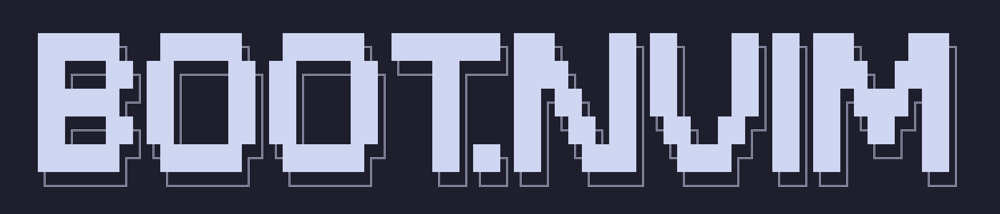
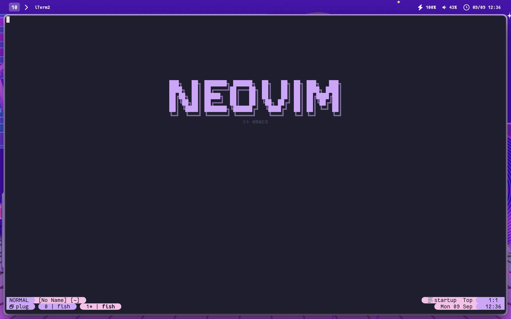

## boot.nvim

  

boot.nvim was created to enhance the visual experience of Neovim by adding a minimal
and customizable boot screen. Unlike other startup plugins, boot.nvim focuses solely
on aesthetics and simplicity, avoiding extra features such as bookmarks or keybindings.
The result is a lightweight plugin that makes Neovim look more polished without
affecting performance.

### Status

- Hosted on [GitHub](https://github.com/piperinnshall/boot.nvim)  
- Lightweight and fast with modular, customizable themes  
- Supports multiple native themes and custom user themes  
- Easy installation via [lazy.nvim](https://github.com/folke/lazy.nvim)
  or [packer.nvim](https://github.com/wbthomason/packer.nvim)  
  (or other Neovim plugin managers)

  

### Challenges

Designing a plugin focused entirely on aesthetics required careful consideration of
performance, modularity, and theme flexibility. Balancing simplicity with customization
options was key: the plugin needed to be both minimal and extensible for users to
create and apply their own themes easily. Ensuring the configuration system was
intuitive and compatible with multiple theme directories added additional complexity.

### Learning

boot.nvim reinforced best practices in Lua plugin development and Neovim API usage.
I gained experience structuring a modular plugin, managing user configuration safely,
and designing a system where content tables drive visual output. Working on theme
modularity improved my understanding of separation between logic and presentation,
while keeping performance overhead minimal.

