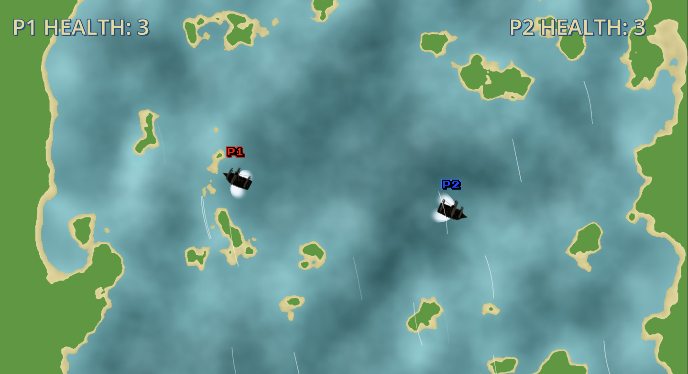
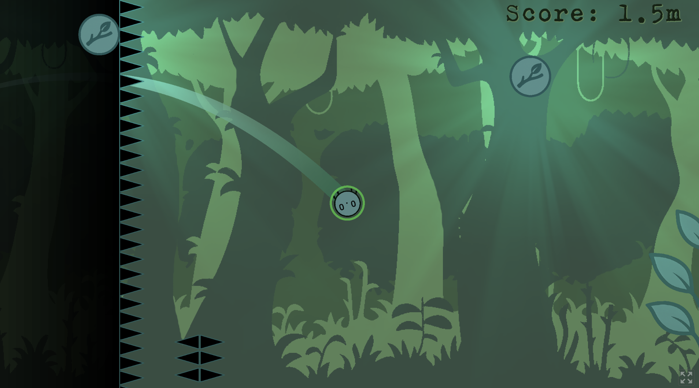
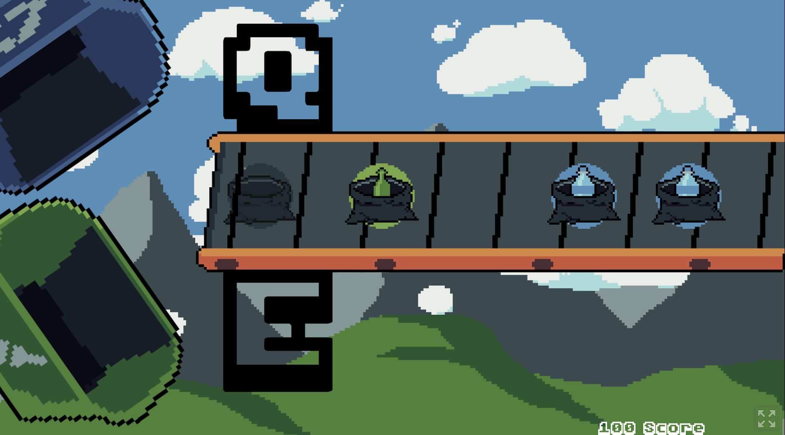

## Game Jam Entries

Over the past year, I created and shipped several small games for different
game jams, each built entirely in Godot using GDScript. These projects were
developed under tight deadlines and rapidly changing ideas, requiring quick
decision-making, fast iteration, and a strong focus on clarity and playability.
The entries include **PP Jam #25**, **Mehu Jam 17**, and the **Week Love Good
Games Jam Special Edition**, each exploring different mechanics, themes, and
technical challenges.

### Status

- **Mehu Jam 17 - Boom Lagoon**  
  [GitHub](https://github.com/piperinnshall/mehu-jam-17)  
  [itch.io](https://piperinnshall.itch.io/boom-lagoon)  

  

- **PP Jam #25 - Itsy Bitsy**  
  [GitHub](https://github.com/piperinnshall/pp-jam-25)  
  [itch.io](https://piperinnshall.itch.io/itsybitsy)  

  

- **WLGG World Day - Beatcycle**  
  [GitHub](https://github.com/piperinnshall/wlgg-world-day)  
  [itch.io](https://piperinnshall.itch.io/beatcycle)    

  

### Challenges

  Designing clear mechanics under strict time limits, balancing scope while
  working with physics and rhythm systems, improving onboarding based on early
  player feedback, implementing procedural generation for dynamic maps, and
  polishing gameplay, audio, and UI within short jam deadlines.

### Learning

  PP Jam #25 helped me refine my understanding of momentum-driven platforming,
  grappling mechanics, and how to teach players new systems quickly. WLGG World
  Day introduced me to rhythm-based design, synchronizing gameplay with audio
  cues and focusing on minimal, readable interactions. Mehu Jam 17, with Boom
  Lagoon, taught me how to transform procedural noise into actionable level data
  and strengthened my collaboration skills while building a two-player
  competitive experience. Across all jams, I gained confidence in rapid
  prototyping, fast yet intentional decision-making, and shipping small polished
  games under real constraints.

